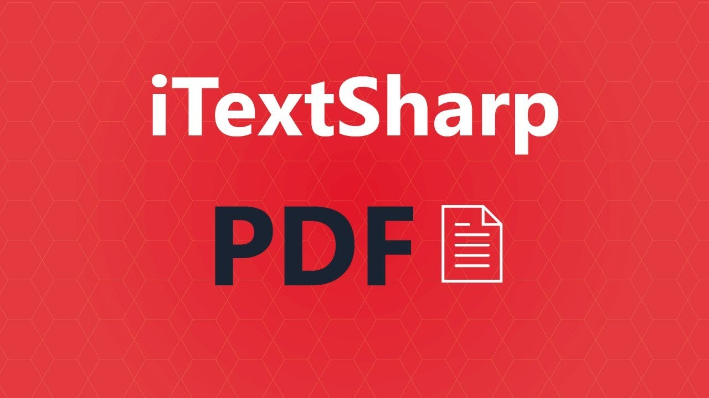

TextSharp is a high level .NET library that permits us to make pdf records from our .NET applications. It gives functionalities to make archives and reports in light of information from data sets or XML documents and union or split pages from existing PDF records. Here, we will investigate the means expected to arrange and utilize iTextSharp in a .NET Core console application.

### Stage 1: Installing iTextSharp for .NET Core

iTextSharp can be downloaded from NuGet. The bundle name is "iTextSharp.LGPLv2.Core"

You can involve the GUI or the accompanying order in the Package Manager Console:

``` 
PM> Install-Package iTextSharp.LGPLv2.Core - Version 1.7.5
```

That is all there is to it, you can now accumulate and run your application and you will actually want to utilize iTextSharp.

### Stage 2: Use iTextSharp to Create a Simple PDF File

The accompanying .NET code is utilized to make a basic PDF record with one passage:

```
using iTextSharp.text;
using iTextSharp.text.pdf;

string text = @"Lorem ipsum dolor sit amet, consectetur adipiscing elit, 
                sed do eiusmod tempor incididunt ut labore et dolore magna aliqua. 
                Ut enim ad minim veniam, quis nostrud exercitation ullamco laboris nisi 
                ut aliquip ex ea commodo consequat. Duis aute irure dolor in reprehenderit 
                in voluptate velit esse cillum dolore eu fugiat nulla pariatur. 
                Excepteur sint occaecat cupidatat non proident, sunt in culpa 
                qui officia deserunt mollit anim id est laborum.";

Document pdfDoc = new Document(PageSize.A4, 7f, 5f, 5f, 0f);
try
{
    Font mainFont = FontFactory.GetFont("Tahoma", 11, new BaseColor(System.Drawing.ColorTranslator.FromHtml("#000")));
    string newFilePath = "C:\\temp\\iTextSharp\\" + "HelloWord.pdf";
    PdfWriter writer = PdfWriter.GetInstance(pdfDoc, new FileStream(newFilePath, FileMode.Create));
    pdfDoc.Open();
    text = text.Replace(Environment.NewLine, String.Empty).Replace("  ", String.Empty);
    Chunk beginning = new Chunk(text, mainFont);
    Phrase p1 = new Phrase(beginning);
    Paragraph p = new Paragraph();
    p.Add(p1);
    pdfDoc.Add(p);
}
catch (DocumentException ex)
{
    throw (ex);
}
catch (IOException ex)
{
    throw (ex);
}
finally
{
    pdfDoc.Close();
}
Console.WriteLine("The file is created.");
Console.ReadLine();s
```