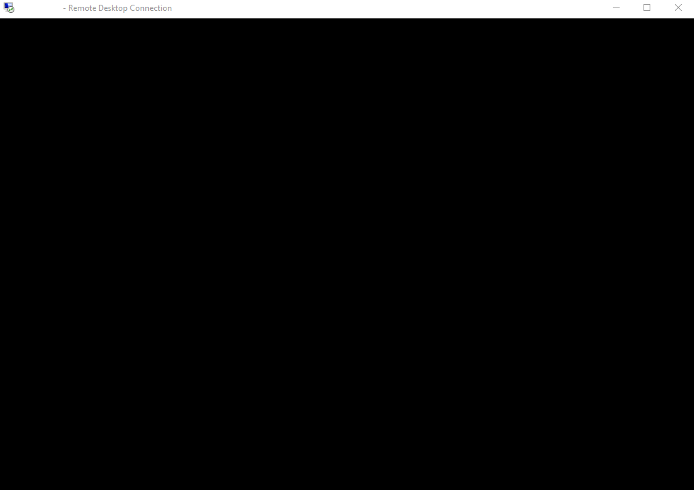
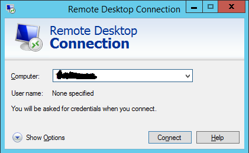
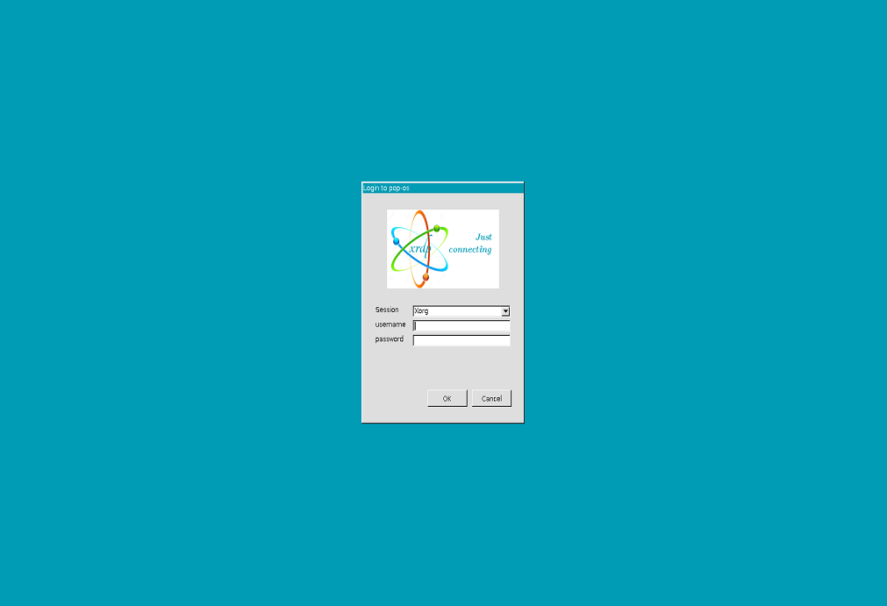

Since we have received a lot of request about installing and configuring xRDP software on top of Pop!_OS, we will provide the necessary steps to perform the installation and post-configuration actions needed to have it working.  If you are following us for a long time, you problaby know about xRDP software, its purpose and how to install it either manually or automatically using the script we are providing.

Since our xrdp-installer script is not supporting (yet?) Pop!_OS, we will perform the xRDP installation manually on the Pop!_OS operating system.

### Prerequisites and assumptions  

The following conditions should be met in order to have the best results while using the script:

* We assume that your machine is connected to internet while performing the installation.  This is needed as additional packages and software needs to be downloaded and installed on your Pop!_OS machine
* We have performed the installation on Pop!_OS 20.04
* No additional Desktop interface is used (xRDP session will be showing Gnome Desktop)
* We are performing a manual installation

### Basic Installation Process 

#### Installing the xRDP package

The manual installation is quite straight forward.  You simply need to open a terminal console and execute some commands.  The manual installation process will be using the xRDP packages available in the Official Pop!_OS Repository.   To perform your installation, you simply need to issue the following command:

```
sudo apt-get install xrdp
```

If requested, please provide the password and press Enter to Proceed with the installation.

To check xRDP version, open a Terminal console and issue the following command:

```
xrdp -v 
```

At this stage, you should be able to perform an remote desktop session but you will not enjoy a seamless user experience.  We will explain later in this posts how to perform the post configuration actions in order to avoid small annoyance while performing the remote desktop connection.  

#### Test your xRDP connection (no post configuration settings yet !!!)

Before trying to perform a remote connection to your Pop!_OS computer,  no one must be logged on on the machine.  Please ensure that the user account that will be used to perform the remote session that this user account is not logged locally on the computer.   This is by design. A same user account can be connected either locally or remotely but not both at the same time…. If you see a black screen when performing the remote desktop connection, this means that the user account performing the remote connection is also logged on locally on the Pop!_OS machine.  So, please logoff from the Pop!_OS machine…..



To test your xRDP connection, open your favourite remote Desktop Client.  Provide the hostname or ip address of the Pop!_OS computer and press the connection button



You will be prompted with a certificate warning.  Press OK to proceed. You will be then presented with the xRDP login page (with a green background)



Provide the credentials and press OK.  If everything is OK, you should see your Pop!_OS desktop presented to you. However, after a few seconds, you will see some dialog box prompting… Provide the credentials and Press OK  in order to proceed.  

### Fixing the Theme and Desktop Look’n Feel  

To fix the Desktop look’n feel, you will simply copy/paste the following commands in the terminal console.

```
sudo cp /etc/xrdp/startwm.sh /etc/xrdp/startwm.sh.bak
sudo sed -i "4 a #Improved Look n Feel Method\ncat << EOF > ~/.xsessionrc\nexport GNOME_SHELL_SESSION_MODE=$GNOME_SHELL_SESSION_MODE\nexport XDG_CURRENT_DESKTOP=$XDG_CURRENT_DESKTOP\nexport XDG_CONFIG_DIRS=$XDG_CONFIG_DIRS\nEOF\n" /etc/xrdp/startwm.sh
```

### Final Notes

We have also tweaked a little bit the Pop!_OS system in order to have a seamless user experience.   As you have seen, it’s really not too difficult to have remote desktop capabilities enabled on a Pop!_OS machine.